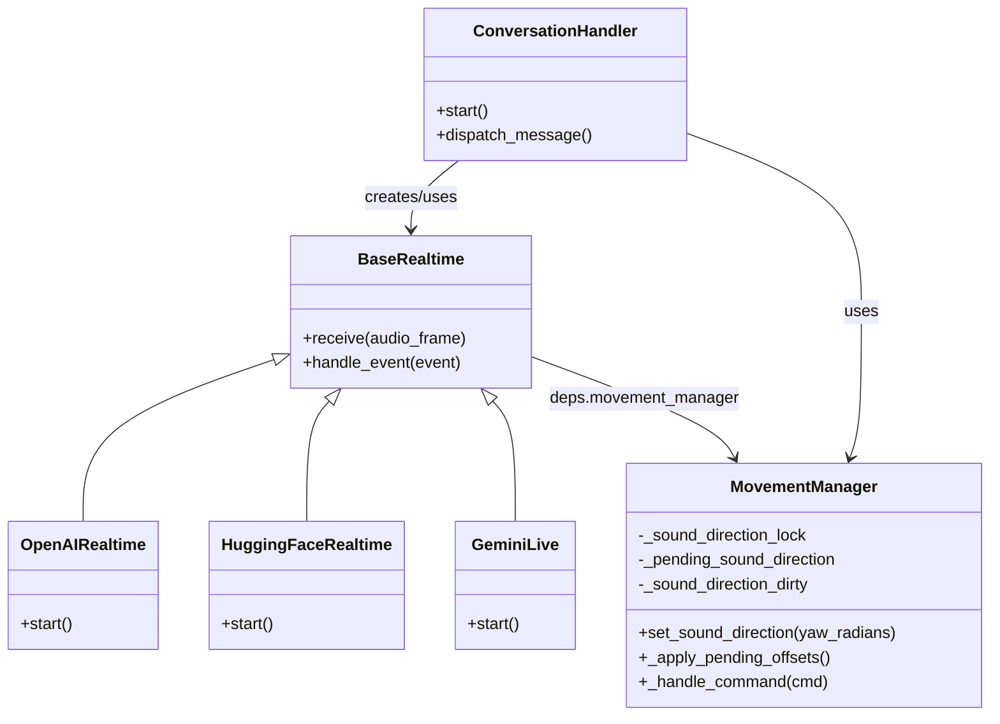
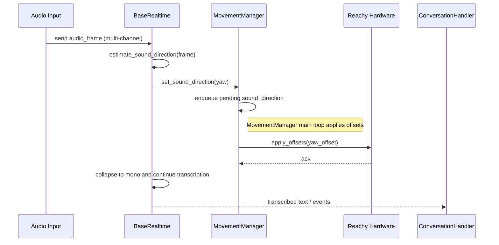

## 项目架构图

本文档基于代码库中的主要模块与类生成：`src/reachy_mini_conversation_app/base_realtime.py`、`src/reachy_mini_conversation_app/moves.py`、`src/reachy_mini_conversation_app/openai_realtime.py`、`src/reachy_mini_conversation_app/huggingface_realtime.py`、`src/reachy_mini_conversation_app/gemini_live.py`、`src/reachy_mini_conversation_app/mcp_client.py`、`src/reachy_mini_conversation_app/main.py`。

---

**类图 (UML)**

以下为简化版类图，展示关键类与它们的主要方法/属性（使用 Mermaid classDiagram）：



相关文件：
- [src/reachy_mini_conversation_app/base_realtime.py](src/reachy_mini_conversation_app/base_realtime.py)
- [src/reachy_mini_conversation_app/moves.py](src/reachy_mini_conversation_app/moves.py)
- [src/reachy_mini_conversation_app/openai_realtime.py](src/reachy_mini_conversation_app/openai_realtime.py)
- [src/reachy_mini_conversation_app/huggingface_realtime.py](src/reachy_mini_conversation_app/huggingface_realtime.py)

---

**序列图**

下面的序列图描述了音频帧到头部转动的典型执行流程：



引用代码：
- [src/reachy_mini_conversation_app/base_realtime.py](src/reachy_mini_conversation_app/base_realtime.py)
- [src/reachy_mini_conversation_app/moves.py](src/reachy_mini_conversation_app/moves.py)

---

**模块图**

下图展示主要模块间的依赖关系：

```mermaid
graph TD
    A[main.py] --> B[conversation_handler.py]
    B --> C[base_realtime.py]
    C --> D[moves.py (MovementManager)]
    C --> E[openai_realtime.py]
    C --> F[huggingface_realtime.py]
    C --> G[gemini_live.py]
    B --> H[mcp_client.py]
    D --> I[reachy SDK / hardware]
    style A fill:#f9f,stroke:#333,stroke-width:1px

```

相关文件：
- [src/reachy_mini_conversation_app/main.py](src/reachy_mini_conversation_app/main.py)
- [src/reachy_mini_conversation_app/conversation_handler.py](src/reachy_mini_conversation_app/conversation_handler.py)
- [src/reachy_mini_conversation_app/mcp_client.py](src/reachy_mini_conversation_app/mcp_client.py)

---

说明与后续建议
- 图均为简化视图，侧重展示实时音频到动作控制的关键路径。
- 如果需要，我可以：
  - 将类图展开为更详细的方法与属性映射；
  - 为每个序列图加入备选分支（例如：speech_stopped 清理 sound_direction）；
  - 生成 PNG/SVG 导出并添加到 `docs/assets/`。
