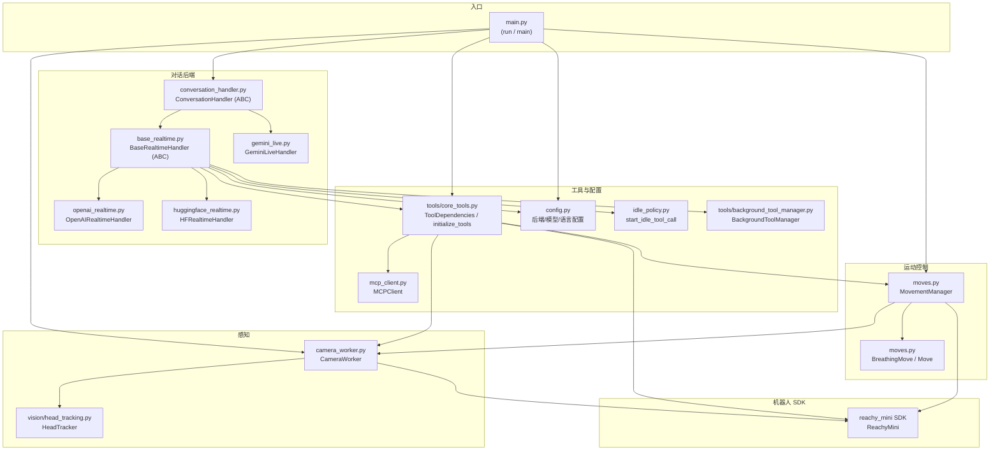
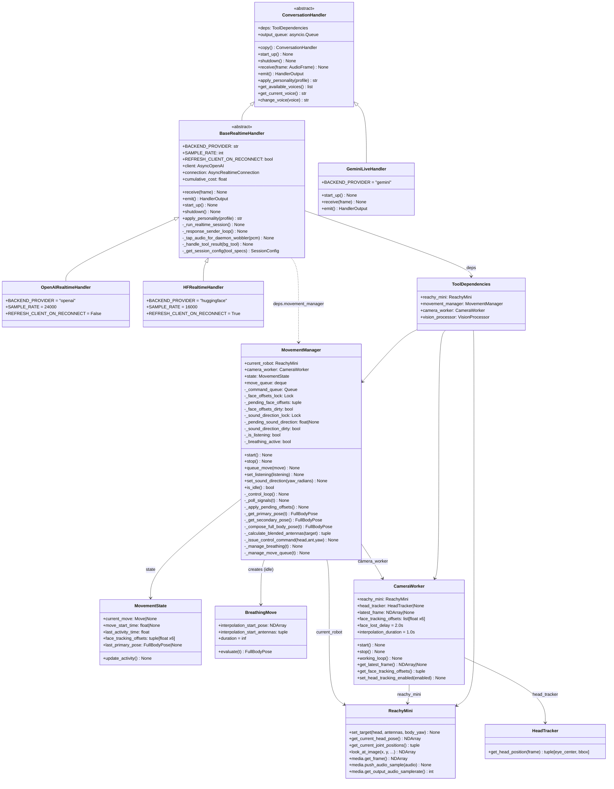
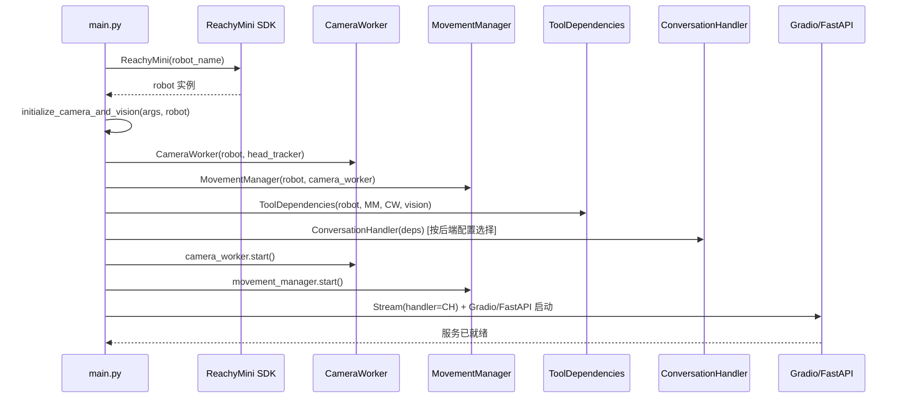
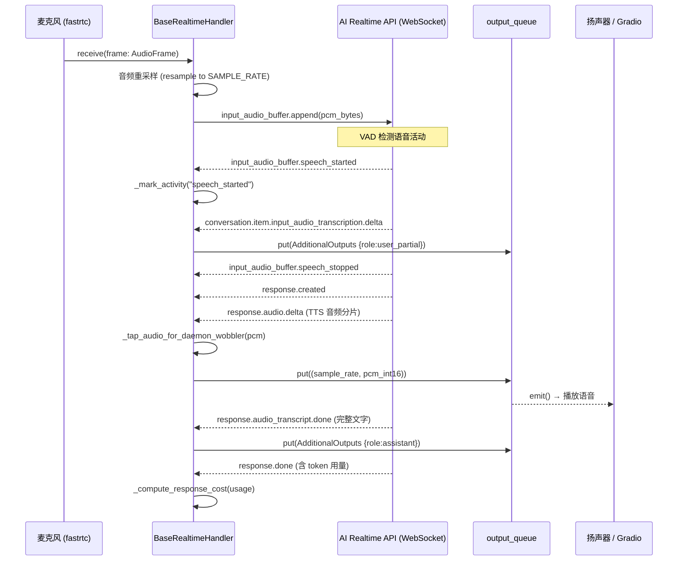
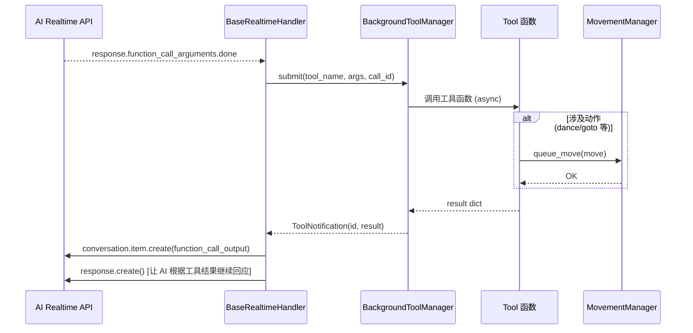
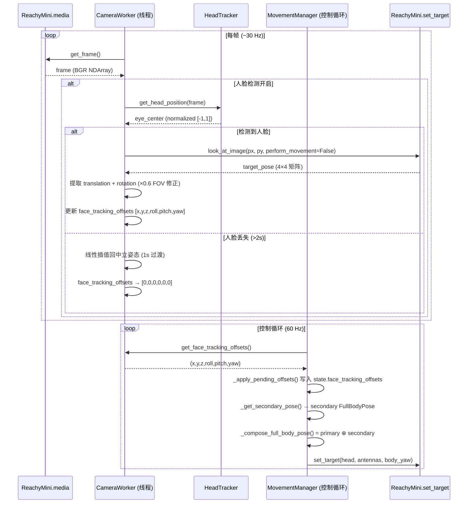
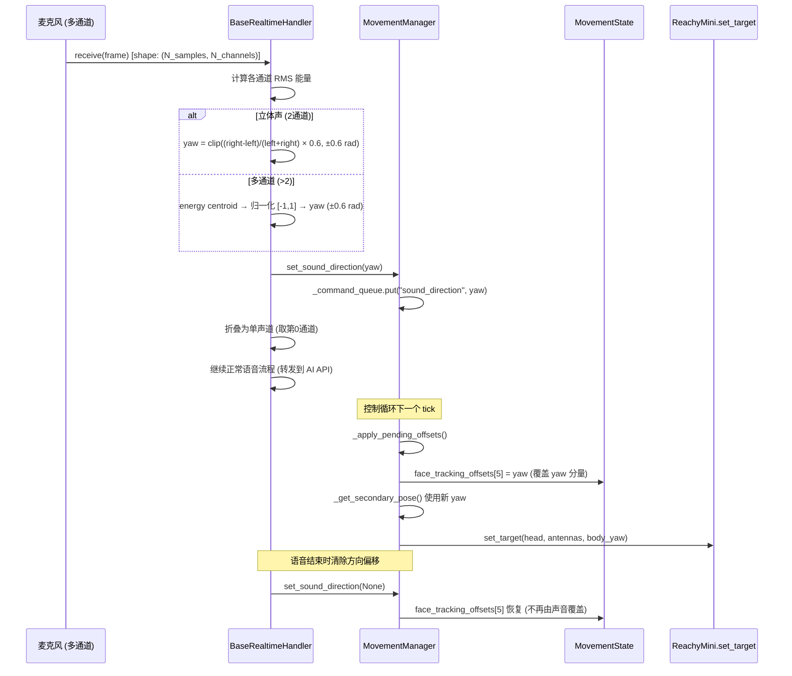

# Reachy Mini Conversation App — 架构文档

本文档基于实际代码，详细描述主流程的类结构、模块依赖与运行时序，涵盖语音输入/输出、人脸检测、声源方向估计和转头控制。

---

## 1. 模块依赖图

> 各模块的导入/调用关系，展示整体分层结构。



---

## 2. 类图 (UML)

> 展示核心类、方法、属性及继承/组合关系。



---

## 3. 序列图

### 3.1 系统启动流程

> `main.py` 初始化所有组件并启动 fastrtc/Gradio 服务。



---

### 3.2 语音输入 → AI 推理 → 语音输出（主对话流程）

> 音频帧经 fastrtc 传入 `BaseRealtimeHandler.receive()`，发往 AI API，响应音频由 `emit()` 输出。



---

### 3.3 工具调用流程

> AI 请求调用工具（如 camera、dance 等），`BackgroundToolManager` 异步执行后回送结果。



---

### 3.4 人脸检测 → 头部跟踪流程

> `CameraWorker` 独立线程持续抓帧、检测人脸，更新偏移量；MovementManager 在控制循环中消费偏移量。



---

### 3.5 声源方向估计 → 头部偏转流程

> 多通道音频帧进入 `BaseRealtimeHandler.receive()`，根据各通道能量估计偏航角，驱动 MovementManager 转头。



---

### 3.6 MovementManager 控制循环（60 Hz 主循环）

> 展示每个 tick 内主姿态、次级偏移、天线融合的完整计算路径。

```mermaid
sequenceDiagram
    participant LOOP as 控制循环 (60 Hz)
    participant CMD as _command_queue
    participant CW as CameraWorker
    participant STATE as MovementState
    participant SDK as ReachyMini.set_target

    loop 每 ~16.7 ms
        LOOP->>CMD: 消费所有待处理命令 (set_listening / queue_move / sound_direction)
        LOOP->>CW: get_face_tracking_offsets()
        CW-->>LOOP: 最新人脸偏移
        LOOP->>STATE: _apply_pending_offsets() [face + sound_direction yaw]

        LOOP->>LOOP: _manage_move_queue(t) [切换主动作]
        LOOP->>LOOP: _manage_breathing(t)
        Note right of LOOP: 无活动 >0.3s → 自动启动 BreathingMove

        LOOP->>LOOP: _get_primary_pose(t) [当前主动作.evaluate(t)]
        LOOP->>LOOP: _get_secondary_pose() [face_tracking_offsets → 4×4]
        LOOP->>LOOP: combine_full_body(primary, secondary)
        Note right of LOOP: compose_world_offset 做世界系叠加

        LOOP->>LOOP: _calculate_blended_antennas(target_antennas)
        Note right of LOOP: 聆听模式 → 天线冻结; 解除后 0.4s 平滑混合

        LOOP->>SDK: set_target(head=..., antennas=..., body_yaw=...)
    end
```

---

### 3.7 空闲呼吸动作流程

> 当无对话活动时，MovementManager 自动启动 `BreathingMove` 保持机器人"存在感"。

```mermaid
sequenceDiagram
    participant MM as MovementManager
    participant BM as BreathingMove
    participant SDK as ReachyMini.set_target

    Note over MM: 无活动 > 0.3s，未在聆听，队列空
    MM->>SDK: get_current_head_pose()
    SDK-->>MM: current_pose
    MM->>SDK: get_current_joint_positions()
    SDK-->>MM: current_antennas
    MM->>BM: BreathingMove(start_pose, start_antennas, interp_duration=1.0)
    MM->>MM: move_queue.append(breathing_move)

    loop 呼吸中 (无限 duration)
        MM->>BM: evaluate(t)
        alt t < 1.0s (过渡阶段)
            BM-->>MM: 线性插值 → 中立姿态
        else t >= 1.0s (呼吸阶段)
            BM-->>MM: z轴 ±5mm sin波 + 天线对向摇摆
        end
        MM->>SDK: set_target(head, antennas, body_yaw)
    end

    Note over MM: 新的主动作入队 → 立即打断呼吸
    MM->>MM: current_move = None; _breathing_active = False
```

---

## 4. 线程模型总览

```mermaid
graph LR
    subgraph Main Thread
        MAIN[main.py / Gradio 事件循环]
    end

    subgraph AsyncIO Event Loop
        BRH[BaseRealtimeHandler\nreceive / emit / event loop]
        BTMGR[BackgroundToolManager\n工具异步执行]
    end

    subgraph Camera Thread
        CW[CameraWorker.working_loop\n~30 Hz 人脸检测]
    end

    subgraph Movement Thread
        MM[MovementManager._control_loop\n60 Hz 控制循环]
    end

    subgraph Robot Daemon
        SDK[ReachyMini SDK\nset_target / get_frame / push_audio]
    end

    MAIN -->|创建并启动| CW
    MAIN -->|创建并启动| MM
    BRH -->|set_sound_direction via queue| MM
    BRH -->|submit tool call| BTMGR
    BTMGR -->|queue_move via queue| MM
    CW -->|face_tracking_offsets (lock)| MM
    MM -->|set_target| SDK
    CW -->|get_frame| SDK
    BRH -->|push_audio_sample| SDK
```

> **并发安全机制**：
> - `CameraWorker` 通过 `face_tracking_lock` 保护 `face_tracking_offsets`；
> - `MovementManager` 通过 `_face_offsets_lock`、`_sound_direction_lock` 暂存待处理偏移；
> - 所有主动作变更均通过 `_command_queue` 由控制线程独占执行，避免竞态。

---

## 5. 关键数据结构

| 类型 | 定义 | 说明 |
|------|------|------|
| `FullBodyPose` | `(NDArray[4×4], (float,float), float)` | 头部姿态矩阵、天线角度对、躯干偏航角 |
| `face_tracking_offsets` | `tuple[float×6]` | (x,y,z,roll,pitch,yaw) 世界系偏移，单位：米/弧度 |
| `AudioFrame` | `(int, NDArray[int16])` | (采样率, PCM 数据) |
| `FullBodyPose` 融合 | `compose_world_offset(primary, secondary)` | 次级偏移在世界系中叠加到主姿态 |

---

*文件路径参考：*
- [src/reachy_mini_conversation_app/main.py](src/reachy_mini_conversation_app/main.py)
- [src/reachy_mini_conversation_app/base_realtime.py](src/reachy_mini_conversation_app/base_realtime.py)
- [src/reachy_mini_conversation_app/moves.py](src/reachy_mini_conversation_app/moves.py)
- [src/reachy_mini_conversation_app/camera_worker.py](src/reachy_mini_conversation_app/camera_worker.py)
- [src/reachy_mini_conversation_app/conversation_handler.py](src/reachy_mini_conversation_app/conversation_handler.py)
- [src/reachy_mini_conversation_app/tools/background_tool_manager.py](src/reachy_mini_conversation_app/tools/background_tool_manager.py)
